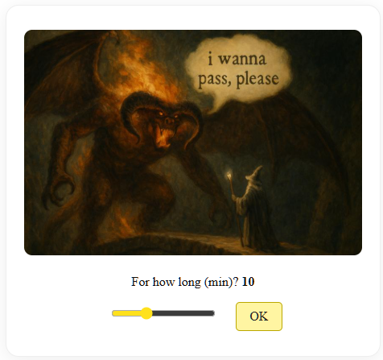
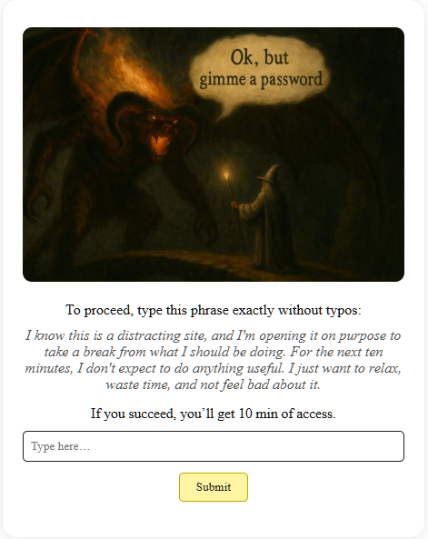

# JavaScript Userscripts

This folder contains user scripts for browser automation, productivity, and blocking distractions.

## Gandalf the Focus Keeper

Blocks access to distracting/time-wasting websites (like social media or news) unless you pass a playful multi-step check. Inspired by “You Shall Not Pass!” from Lord of the Rings.

**Features:**

- Customizable: Pick how long you want to unblock a site (1–30 minutes).
- Exact-phrase challenge (prevents mindless unblocking).
- Tampermonkey-compatible.

**How to use:**

1. [Install Tampermonkey](https://www.tampermonkey.net/) (or similar extension) in your browser.
2. Copy the script (`Gandalf the Focus Keeper.user.js`) into Tampermonkey’s dashboard as a new script.
3. Edit the list of sites (`@match` lines) if you want to block different sites.
4. Visit a blocked site - Gandalf will greet you!

**Reset the timer:**  
If you want to reset Gandalf’s block timer, open the site with `?reset` at the end of the URL (e.g. `https://dtf.ru/?reset`).

## How it works

**When a blocked site is opened:**

- The browser tab and favicon change:

**Then, you must pass through these 3 steps:**

1. **Plea step:**

   

2. **Pick time step:**

   

3. **Phrase challenge:**

   

---

Other scripts may be added here in the future.

---

**Disclaimer: LLMs may have been used to help generate code and README content in this repo.**
